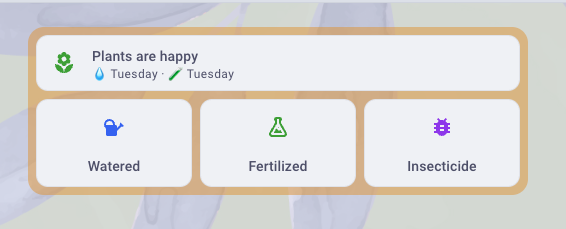
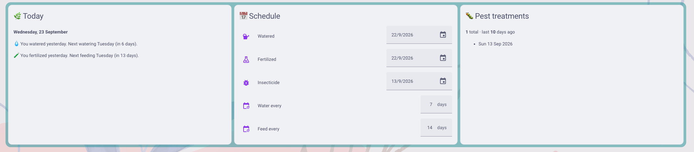

# 🌿 plant-care-ha

A tiny Home Assistant plant calendar that helps me not kill (or forget) my plants.

I water all my plants on the same rhythm and adjust by feel with a moisture meter, so I don't need a separate tracker for each plant (for now). Press a button when you've watered, fertilized or sprayed, and the dashboard tells you what's next.

<p align="center">
  
</p>
<p align="center">
  
</p>

## Features

- **One-tap logging:** buttons for *watered today*, *fertilized today* and *used insecticide today*
- **Friendly reminders:** "Today is Monday. You watered last Monday. You need to water again. You used fertilizer two weeks ago. Use fertilizer today."
- **Status at a glance:** one icon that changes color
- **Pest log:** keeps every insecticide date permanently, so you can spot outbreak patterns
- **Adjustable rhythm:** set the watering and fertilizing intervals from the UI

### Status icon

| Icon | Meaning |
|---|---|
| 🟢 Green flower | Plants are happy |
| 🟠 Orange watering can | Watering day, stays orange for 3 days |
| 🟠 Orange sprout | Fertilizer day |
| 🟠 + 🔴 flask badge | Water is fine, but you forgot the fertilizer |
| 🔴 Red water alert | More than 3 days late. Water. Now. |

## Files

```
packages/plants.yaml             # helpers, scripts, sensors
custom_templates/plants.jinja    # date math + friendly wording
cards/plant-header-card.yaml     # status icon + the three buttons
cards/plant-info-card.yaml       # wide info row: summary, schedule, pest log
```

## Requirements

- Home Assistant **2024.10** or newer
- [Mushroom](https://github.com/piitaya/lovelace-mushroom) (via HACS), needed for the header card only. The info card uses core cards.

## Setup

1. **Enable packages** in `configuration.yaml`. If you already have a `homeassistant:` section, add the line inside it instead of creating a second one:

   ```yaml
   homeassistant:
     packages: !include_dir_named packages
   ```

2. **Copy the files** into your config folder:
   - `packages/plants.yaml` → `/config/packages/plants.yaml`
   - `custom_templates/plants.jinja` → `/config/custom_templates/plants.jinja`

3. **Check and restart:** go to *Developer Tools → YAML → Check configuration*, then restart Home Assistant.

4. **Set your rhythm:** in *Settings → Devices & services → Entities*, set
   - **Water every** (e.g. `7` days)
   - **Fertilize every** (e.g. `14` days)

   These start at their minimum value, so do this once after the first restart.

5. **Log a starting point:** press each button once, or set the three "last…" dates by hand. Until then the status shows grey.

6. **Add the cards:** on your dashboard choose *Edit → Add card → Manual* and paste in:
   - `cards/plant-header-card.yaml` for your main or glance dashboard
   - `cards/plant-info-card.yaml` for a full-width info dashboard (works best in a *sections* or *panel* view)

## Tips

- **Pressed a button by accident?** Tap the date in the info card's schedule and correct it.
- **Changed your mind about the rhythm?** Adjust the intervals anytime. The status updates immediately.
- **"Due" window:** after the interval is reached you have 3 days of orange before it turns red. Change the `+ 3` in `plants.jinja` if you want a different grace period.

## Troubleshooting

**`Integration 'packages' not found`**
`packages:` is at the top level of `configuration.yaml`. It needs to be indented two spaces under `homeassistant:`.

**Status stays grey / "Log your first watering"**
No dates are set yet. Press the buttons once.

**Header card shows "Custom element doesn't exist"**
Mushroom isn't installed, or the browser needs a hard refresh after installing it.

## Ideas / maybe later

- Per-plant tracking
- Notifications on red status
- Moisture sensor integration

---

Made so my plants stop giving me that look. 🪴
